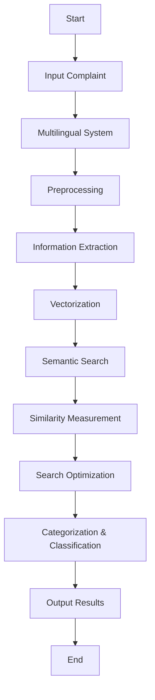

Here's a markdown code for an impactful README file for your project, including a flowchart using Mermaid:

```markdown
# CRIME: Comprehensive Real-time Intelligent Model for Evaluation

## Problem Statement
Development of an NLP Model for Text Analytics and Classification

### Objective
- To develop an NLP model that categorizes complaints based on victim, type of fraud, and other relevant parameters used for text classification and preparing the final model.

### Outputs
- **Text Preprocessing**: Tokenization, stop word removal, stemming, and text cleaning to prepare data.
- **Model Development**: Selection of a suitable NLP model for text classification.
- **Accuracy Measurement**: Evaluate the model based on metrics such as accuracy, precision, recall, and F1-score.

## Solution Overview
CRIME (Comprehensive Real-time Intelligent Model for Evaluation) is designed to process crime information through a multimodal multilingual conversational system. It extracts key parameters such as the victim, type of fraud, and other relevant details, converting them into vector representations for further analysis.

### Approaches Used
1. **Semantic Search**
2. **Euclidean Similarity**: Measures the distance between vector ends, normalized to ensure a value between 0 and 1.
   - Formula: `score = 1 / (1 + euclidean(v1,v2))`
3. **Multimodal Multilingual Conversational System**
4. **Hierarchical Navigable Small Worlds (HNSW)**
5. **Exact Nearest Neighbor (ENN) and Approximate Nearest Neighbor (ANN)**

## Flowchart


## Endpoints Available
- **Predict**: Endpoint for categorizing a single complaint and returning the predicted category.
- **Search Similar Case**: Endpoint for finding cases similar to a given complaint based on vector similarity.
- **Predict Bulk**: Endpoint for processing and categorizing multiple complaints in bulk.

## Getting Started
To get started with CRIME, follow the installation instructions and explore the available endpoints to integrate the model into your application.

## License
This project is licensed under the MIT License - see the [LICENSE](LICENSE) file for details.

## Acknowledgments
- Thanks to all contributors and supporters of this project.
```

This README provides a comprehensive overview of your project, including the problem statement, solution, approaches used, and a flowchart to visualize the process.