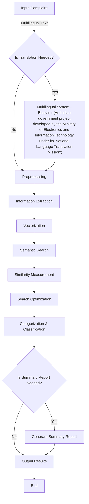

# README

## Problem Statement

**Development of an NLP Model for Text Analytics and Classification**

### Objective:
- To develop an NLP model that categorizes complaints based on victim, type of fraud, and other relevant parameters used for text classification and preparing the final model.

### Outputs:
- **Text Preprocessing**: Tokenization, stop word removal, stemming, and text cleaning to prepare data.
- **Model Development**: Selection of a suitable NLP model for text classification.
- **Accuracy Measurement**: Evaluate the model based on metrics such as accuracy, precision, recall, and F1-score.

## Solution: CRIME (Comprehensive Real-time Intelligent Model for Evaluation)

The CRIME model processes crime information through a multimodal multilingual conversational system to translate it, extract the victim, type of fraud, and other relevant information, and convert the extracted crime information into a vector.

### Approaches Used:
1. **Semantic Search**
2. **Euclidean Similarity**: Measures the distance between ends of vectors. This value allows you to measure similarity based on varying dimensions. For Euclidean similarity, Atlas Vector Search uses the following algorithm to normalize the score to ensure a value between 0 and 1:
   \[
   \text{score} = \frac{1}{1 + \text{euclidean}(v1, v2)}
   \]
3. **Multimodal Multilingual Conversational System**
4. **Hierarchical Navigable Small Worlds (HNSW)**
5. **Exact Nearest Neighbor (ENN) and Approximate Nearest Neighbor (ANN)**

## Flowchart

## Endpoints Available

- **Predict**: Endpoint for categorizing a single complaint and returning the predicted category.
- **Search Similar Case**: Endpoint for finding cases similar to a given complaint based on vector similarity.
- **Predict Bulk**: Endpoint for processing and categorizing multiple complaints in bulk.