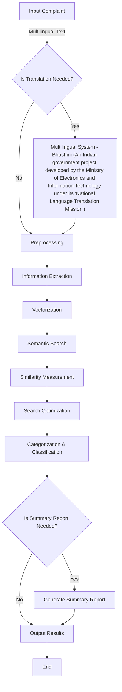

# CRIME (Comprehensive Real-time Intelligent Model for Evaluation)

The CRIME model processes crime information through a multimodal multilingual conversational system to translate it, extract the victim, type of fraud, and other relevant information, and convert the extracted crime information into a vector.

### Approaches Used:
1. **Input Complaint**: Accept complaint data in multilingual text format from users for processing.
2. **Multilingual System**: Translate text to a common language (if needed) for consistent processing using a multimodal multilingual system.
3. **Preprocessing**: Clean and prepare the text using tokenization, stopword removal, and lemmatization to standardize the input for further analysis.
4. **Information Extraction**: Extract critical parameters, such as victim type, fraud type, and any additional relevant context using NLP techniques like named entity recognition and dependency parsing.
5. **Vectorization**: Convert the extracted information into vector representations to facilitate similarity comparison.
6. **Semantic Search**: Utilize advanced algorithms to perform a semantic match against predefined complaint categories, identifying relevant types based on meaning and context.
7. **Similarity Measurement**: Use Euclidean distance to measure the similarity between complaint data and predefined categories, ensuring a normalized score between 0 and 1 using the formula:
   
   ```math
   \text{score} = \frac{1}{1 + \text{euclidean}(v1, v2)}
   ```


8. **Search Optimization**: Apply Hierarchical Navigable Small Worlds (HNSW) for efficient search, and use Exact Nearest Neighbor (ENN) and Approximate Nearest Neighbor (ANN) methods to balance speed and accuracy.
9. **Categorization & Classification**: Assign the complaint to a specific category based on similarity analysis and store the result in a database for record-keeping and further reference.
10. **Output Results**: Display the final categorized output and generate a summary report if required for user review or administrative purposes.
11. **End Process**: Complete the categorization and classification process, preparing the system for the next input.


## Project Structure

```
- pipeline/
  - embeddings/
    - establisher/
      - createIndex.js
    - generating/
      - getEmbeddings.js
- endpoints/
  - forQuickDemo.js
  - predictEndpoint.js
  - predictFileEndpoint.js
  - similaritySearch.js
  - translateEndpoint.js
- models/
  - predictFileModel.js
  - predictModel.js
  - similaritySearchModel.js
  - testModel.js
  - trainModel.js
- translator/
  - translationService.js
- index.js
```


## Workflow
### 1. Text Preprocessing
- **Tokenization**: Splitting text into individual words or tokens.
- **Stop Word Removal**: Removing common words that do not contribute to the meaning.
- **Stemming**: Reducing words to their base or root form.
- **Text Cleaning**: Removing special characters, numbers, and other irrelevant data.

### 2. Model Development
- **Embedding Generation**: Using the `getEmbedding` function in [pipeline/embeddings/generating/getEmbeddings.js](pipeline/embeddings/generating/getEmbeddings.js) to convert text into numerical vectors.
- **Index Creation**: Creating a vector index using the `createIndex` function in [pipeline/embeddings/establisher/createIndex.js](pipeline/embeddings/establisher/createIndex.js).
- **Model Training**: Training the model using the `trainModel` in [pipeline/models/trainModel.js](pipeline/models/trainModel.js).

### 3. Accuracy Measurement
- **Evaluation Metrics**: Using metrics such as accuracy, precision, recall, and F1-score to evaluate the model's performance.

## Endpoints
### Running the Project
To run the project, use the following command:
```
npm start
```
This will start the server and make the endpoints available at `http://localhost:5000`

### 1. Similarity Search
- **Endpoint**: `/search`
- **Description**: Finds cases similar to a given complaint based on vector similarity.
- **Implementation**: [endpoints/similaritySearch.js](endpoints/similaritySearch.js)

### 2. Predict
- **Endpoint**: `/predict`
- **Description**: Categorizes a single complaint and returns the predicted category.
- **Implementation**: [endpoints/predictEndpoint.js](endpoints/predictEndpoint.js)

### 3. Predict Bulk
- **Endpoint**: `/predictFile`
- **Description**: Processes and categorizes multiple complaints in bulk.
- **Implementation**: [endpoints/predictFileEndpoint.js](endpoints/predictFileEndpoint.js)

### 4. Translate
- **Endpoint**: `/translate`
- **Description**: Translates text to the desired language.
- **Implementation**: [endpoints/translateEndpoint.js](endpoints/translateEndpoint.js)

### 5. Quick Demo
- **Endpoint**: `/demo`
- **Description**: Provides a quick demonstration of the model's capabilities.
- **Implementation**: [endpoints/forQuickDemo.js](endpoints/forQuickDemo.js)


## Flowchart




## Endpoints Available

- **Predict**: Endpoint for categorizing a single complaint and returning the predicted category.
- **Search Similar Case**: Endpoint for finding cases similar to a given complaint based on vector similarity.
- **Predict Bulk**: Endpoint for processing and categorizing multiple complaints in bulk.

